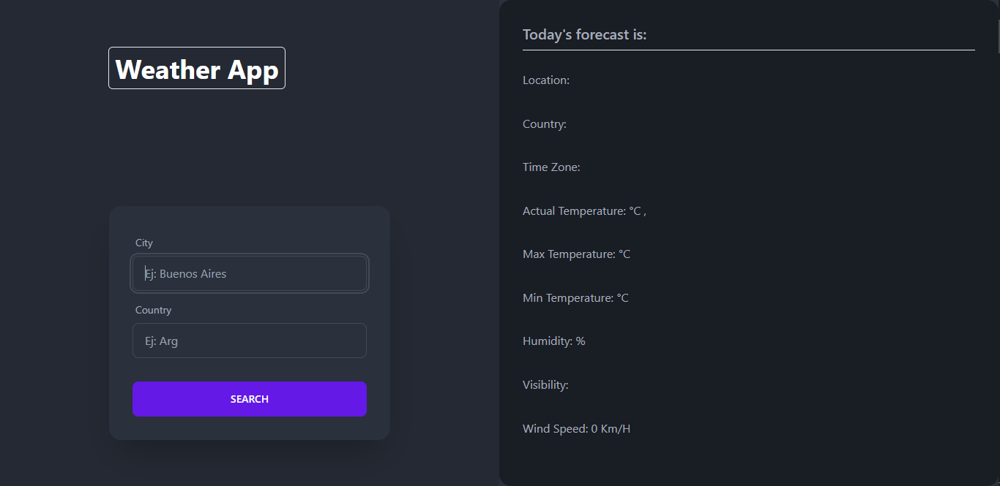

 # Weather App

It's a simple weather application, which is built with React.js and consumes the OpenWeather api, which is mapped with Tailwind and DaisiUi.

# Thank you for viewing my repository

# Getting Started with Create React App

In the project directory, you can run:

### `npm start`

Runs the app in the development mode.\
Open [http://localhost:3000](http://localhost:3000) to view it in your browser.

The page will reload when you make changes.\
You may also see any lint errors in the console.

### Deployment

You can use de Weather App in [https://weatherapp-hamipluf.vercel.app/]